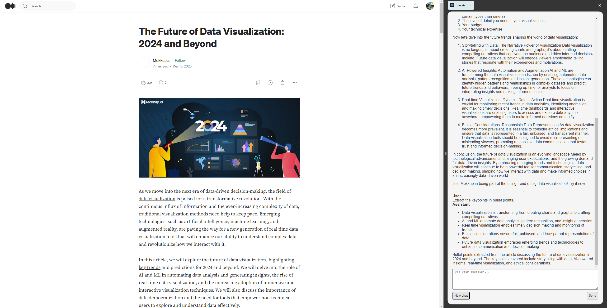

# Jarvis: A Chrome Extension for Contextual Insights

The Jarvis Chrome Extension is a tool designed to leverage the capabilities of a Language Learning Model (LLM) to enhance browsing experience. By  analyzing the context of current webpage, Jarvis provides tailored responses to your queries, offering a unique blend of convenience and insight.

## Getting Started

These instructions will get you a copy of the project up and running on your local machine for development and testing purposes.

### Prerequisites

- Node.js
- Python
- Flask
- Socket.IO

### Installation

1. Clone the repository.
2. Navigate to the `extension` directory and run `npm install` to install the necessary Node.js dependencies.
3. Navigate to the `server` directory and set up your Python environment. Install the necessary Python dependencies using `pip install -r requirements.txt`.
4. For using LLM Studio or OpenAI:
   - **LLM Studio**: Set up a local inference server using [LLM Studio](https://lmstudio.ai/). Ensure LLM Studio is installed and configured on your machine.
   - **OpenAI**: If you prefer using OpenAI's API, ensure you have an OpenAI API key. You can obtain one from [OpenAI's website](https://openai.com/).

## Usage

### Setup the LLM

For inference you can either use OpenAI's API or a local inference server using LLM Studio.

   - For LLM Studio, ensure the local inference server is running before starting the Flask server.
   - For using OpenAI API, modify the `app.py` file to use the OpenAI API key on line 8: `client = OpenAI(...)`
  
### Starting the Flask Server

In order to use the extension, you must start the Flask server. This can be done by running the `windows.bat` (for Windows) or `mac.sh` (for MacOS) script in the `server` directory. This will start the Flask server on port 4321.

NB: You can replace the target executable in the Chrome shortcut with the `windows.bat` (for Windows) or `mac.sh` (for MacOS) script to automatically start the Flask server and Chrome when you open Chrome.

### Loading the Extension

Load the extension into Chrome by following [these instructions](https://developer.chrome.com/docs/extensions/mv3/getstarted/).

### Using the Extension

Click on the extension icon in the Chrome toolbar and enter your query. The extension will use the current webpage's context and the LLM to provide a response.

## Contributing

Pull requests are welcome :smile:.
